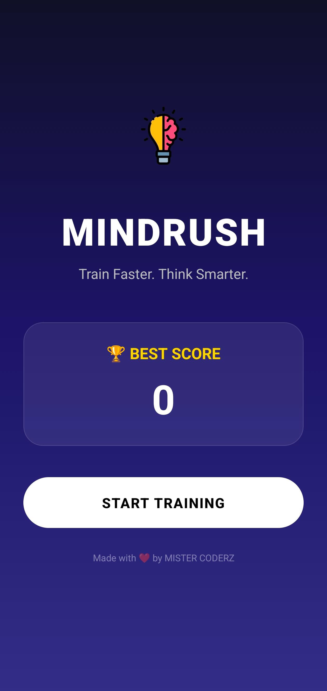
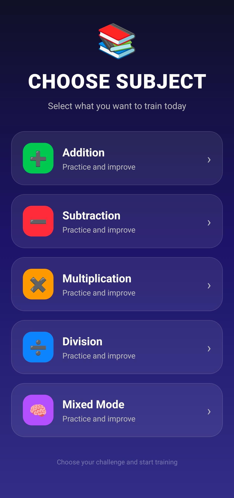
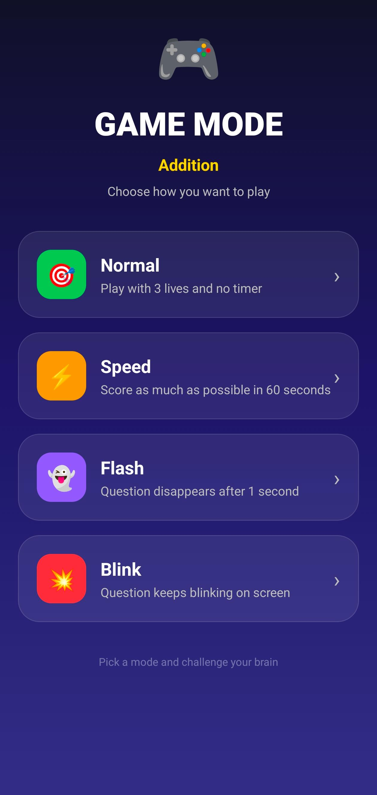
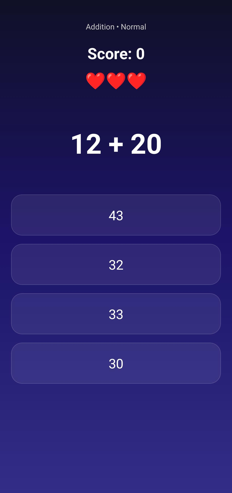
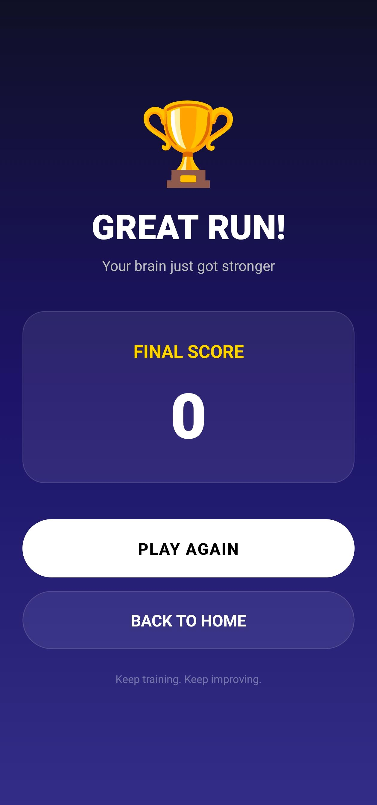

# 🧠 MindRush – Brain Training & Mental Math Challenge

MindRush is a modern brain-training mobile application designed to improve mental arithmetic speed, concentration, memory retention, and decision-making through engaging math-based challenges.

Built with React Native, Expo, TypeScript, and Expo Router.

---

## 🚀 Features

### Subjects
- ➕ Addition
- ➖ Subtraction
- ✖️ Multiplication
- ➗ Division
- 🔀 Mixed Mode

### Game Modes
- 🎯 Normal Mode
- ⚡ Speed Mode
- 👁️ Flash Mode
- 🔄 Blink Mode

### Gameplay Features
- Real-time score tracking
- Best score saving
- Haptic feedback
- Smooth animations
- Dynamic question generation
- Instant result summaries

---
## 📱 Screenshots

  
  
  

  
  

---

## 🛠️ Tech Stack

- React Native
- Expo SDK 54
- TypeScript
- Expo Router
- React Native Reanimated
- Expo Haptics
- AsyncStorage

---

## 📦 Download APK

### Latest Release

Download the latest APK from the Releases section:

👉 [Download MindRush APK](../../releases)

---

## 🎯 Purpose

MindRush transforms traditional arithmetic practice into an engaging game experience.

The app helps improve:

- Mental Calculation Speed
- Focus & Concentration
- Short-Term Memory
- Numerical Reasoning
- Problem Solving Skills
- Reaction Time

---

## 🔮 Future Updates

- Daily Challenges
- Achievements System
- XP & Levels
- Global Leaderboards
- Streak Tracking
- Themes & Customization

---

## 👨‍💻 Developer

**Kartik Singh**

### Built and maintained under MISTER CODERZ

Website:
https://mistercoderz.com

---

## ⭐ Support

If you like the project, consider starring the repository.
